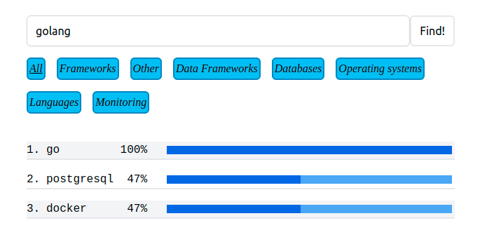

# Sources of  <a href="https://gonahh.ru/" target="_blank">gonahh.ru</a>


## Local start up

The only dependcy for local start up is <a href="https://docs.docker.com/compose/install" target="_blank">docker-compose</a>:

```
$ docker-compose up --build
#
#Wait a dozen of seconds until
#
gonahh_datahandler exited with code 0
```

Go to `localhost:8080` and see how it's working:



Exit as you played enough:

```
^C
$ docker-compose down
```

If you want to fetch recent <a href="https://hh.ru/" target="_blank">hh.ru</a> statistics, do as follows and rerun services (it takes up to 10 minutes due to rate limits):

```
go run ./cmd/datahandler --fetchto exampleData/data.sql --banwords exampleData/bannedWords --categories exampleData/categories
```
